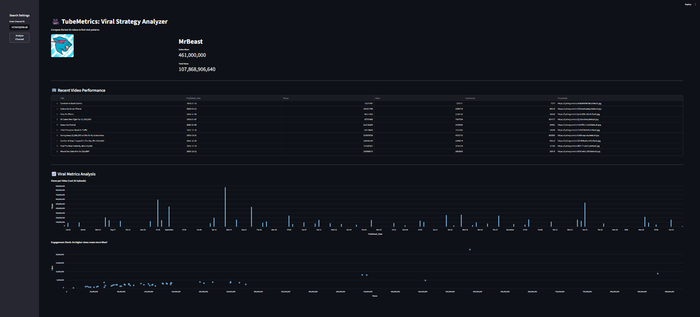
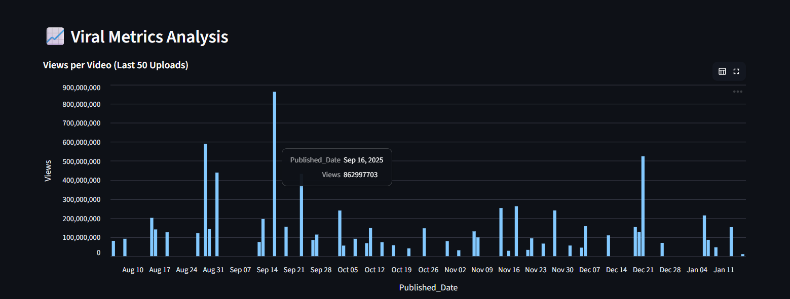
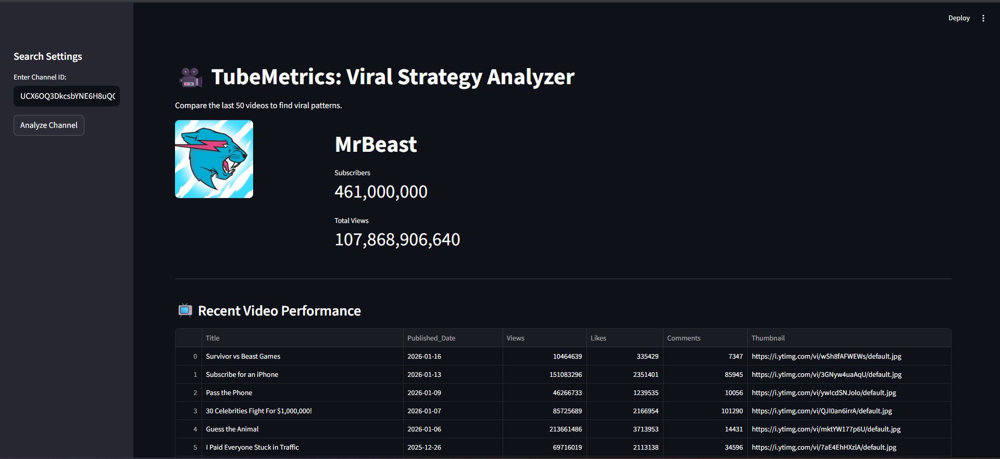

# 🎥 TubeMetrics: YouTube Viral Strategy Dashboard

### 📌 Project Overview
TubeMetrics is a data analytics tool built with **Python & Streamlit** that connects to the **YouTube Data API**. It allows users to analyze the performance of any YouTube channel, identifying viral trends by visualizing view counts and engagement metrics (Likes vs. Views) for the last 50 videos.

**Key Features:**
* 🔴 **Live API Connection:** Fetches real-time channel stats (Subs, Total Views).
* 📊 **Interactive Dashboard:** Visualizes video performance using Bar & Scatter charts.
* 💾 **Data Export:** Allows users to download the raw dataset as a CSV file for further analysis.

---

### 📸 App Interface

#### 1. The Full Dashboard
*Analyzing MrBeast's channel to identify viral spikes.*

  

#### 2. Strategy Charts
*Visualizing the upload consistency and viral hits.*

  

#### 3. Data Extraction
*Fetching the last 50 videos with full metadata (Views, Likes, Comments).*

  

---

### 🛠️ Tech Stack
* **Python:** Core logic and data processing.
* **Google API Client:** To authenticate and fetch data from YouTube.
* **Streamlit:** For building the interactive web UI.
* **Pandas:** For data manipulation and CSV export.
